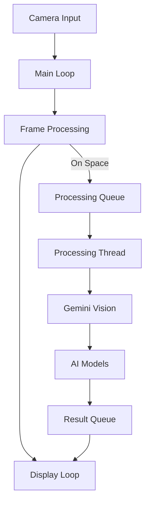

# System Patterns: AI Helper

## Architecture Overview



## Core Components

1. Main Loop (`main.py`)

   - Camera initialization and configuration
   - Frame capture and display
   - User input handling
   - Thread management
   - Status management

2. Processing Thread (`processing_thread.py`)

   - Asynchronous image processing
   - Text extraction coordination
   - Multi-model response gathering
   - Result queue management

3. Frame Processing (`frame_processing.py`)

   - Image preprocessing
   - Text extraction interface
   - Response formatting

4. UI Drawing (`drawing.py`)
   - Overlay rendering
   - Status display
   - Result visualization

## Design Patterns

1. Producer-Consumer Pattern

   - Main thread (Producer): Captures frames
   - Processing thread (Consumer): Handles AI processing
   - Queue-based communication for thread safety

2. Observer Pattern

   - Status updates through queue system
   - UI updates based on state changes
   - Event-driven processing flow

3. State Management
   - Application states: Ready, Processing, Error
   - Result states: None, Partial, Complete
   - Clear state transitions and handling

## Data Flow

1. Image Capture

   ```mermaid
   flowchart LR
       Camera --> Frame[Frame Buffer]
       Frame --> Display[Display Loop]
       Frame -- On Trigger --> Queue[Processing Queue]
   ```

2. Processing Pipeline

   ```mermaid
   flowchart LR
       Queue[Processing Queue] --> Vision[Gemini Vision]
       Vision --> Text[Text Extraction]
       Text --> Models[AI Models]
       Models --> Results[Result Queue]
   ```

3. Result Handling
   ```mermaid
   flowchart LR
       Results[Result Queue] --> Parse[Parse Response]
       Parse --> Update[Update UI]
       Update --> Display[Display Frame]
   ```

## Error Handling

1. Camera Errors

   - Initialization failures
   - Frame capture issues
   - Device disconnection

2. Processing Errors

   - Text extraction failures
   - AI model timeouts
   - Invalid responses

3. Resource Management
   - Clean shutdown procedures
   - Resource cleanup
   - Temporary file handling

## Performance Considerations

1. Threading Model

   - Non-blocking main loop
   - Asynchronous processing
   - Queue-based communication

2. Resource Usage

   - Efficient frame buffer management
   - Controlled API request timing
   - Memory cleanup during operation

3. Response Time
   - Frame capture cooldown
   - Parallel model processing
   - UI update optimization
